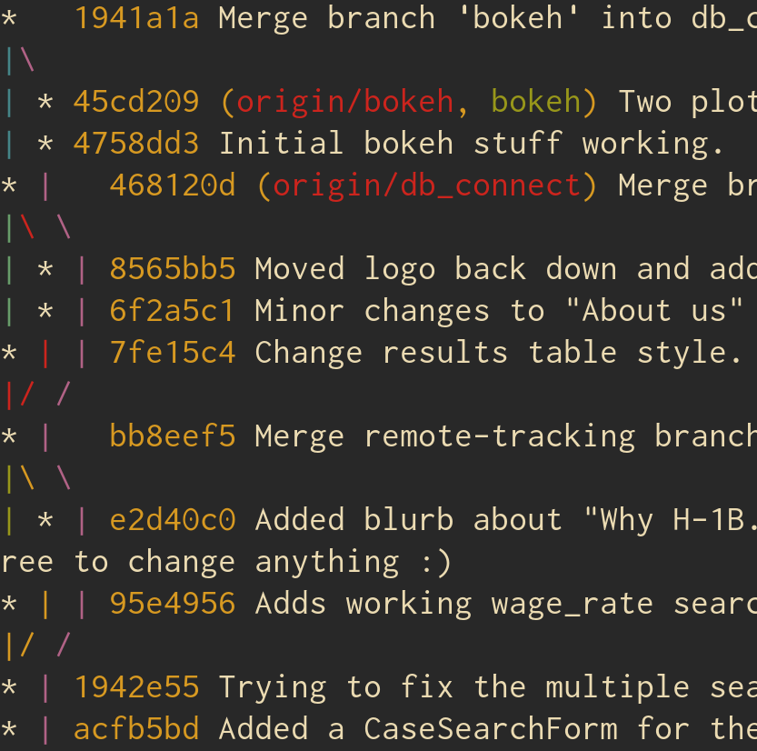

# Basics

## Structure

### How is Git structured on the backend?

#### Commits

If you've used Git at all before, you're probably familiar with the idea that it uses _commits_ to track changes.
Or maybe it tracks files? 
Well it tracks something, right?
I mean, that's how it does\ldots whatever it is that is actually does.

Many other version control systems (VCS) store changes as files and the changes made over time (these types of systems are referred to as _delta-based_ (Figure \ref{delta}).)


Although many people think of it this way (I did until I put together this document), Git is __not__ delta-based.
Instead, it stores snapshots of the current state of each file, while unchanged files are represented by a link to the previous identical file (Figure \ref{snapshot-based}).


Everything in Git (including commits) is hashed using SHA-1 and stored by this hash value.

#### The three stages of Git

Or more accurately, the three areas of Git. 
The _.git directory_ is where the metadata and object database for a repository is stored, and is what is actually copied when cloning a project (along with the files themselves.)
The _working tree_ is a checked-out version of the project. 
These are the files themselves which are actually modified by the user.
The _staging area_ (or _index_) is a file in the .git directory which stores information about what will go into the next commit.

## Basic workflow

The three areas provide a fairly intuitive workflow.
Files are edited in the working tree.
Whenever these edits reach a point where they should be committed, the files are added into the staging area.
The staged files are then committed with a ___useful message___, and added to the .git directory.

The obvious question then becomes

"How do I know when I should commit something?"

and

"Wait, you haven't actually told me how to do anything, this is just a bunch of technical nonsense with no useful method of application."

Well that is technically not a question, but ok.

## git add

If you have used Git on the command line before, this is pretty basic.
If not, these commands should be very similar to however you had been using Git in the past (SmartGit etc.)

`git add` copies files from the working tree into the staging area.

### Examples

`git add PATH [PATH2] ...` -- Stages `PATH(S)`.
Pass a dot '`.`' to add all files in the current directory.

#### Flags

`-n` -- Perform a dry-run: just show if the files specified will be added or not, but do not actually add anything.

`-i` -- Perform an interactive add.

### Reference

[`git add` documentation](https://git-scm.com/docs/git-add)

Now that you have all of the files added, it is time to commit the changes.

## git commit

Writes the staged changes to the commit history, along with an associated hash value.
A text editor will be opened to add a commit message.

### Examples

`git commit` -- Commit the changes specified in the index.

`git commit [PATH] [PATH2] ...` -- Commit the changes to the specified files, ignoring the index.

#### Flags

`-m MESSAGE` -- Specify a message in the command line without opening an editor.

`--amend` -- Combines the current indexed changes with the last commit into a single commit.
If you have already pushed the most recent commit, it is advisable to instead just create a new commit to fix whatever issue.

`--interactive` -- Perform an interactive commit (equivalent to `git add --interactive`).

### Reference

[`git commit` documentation](https://git-scm.com/docs/git-commit)

A possible scenario: you `add` a number of changes, but realize too late that one file should not have been added to the index.

How do you undo this?

Another scenario: you `commit` your changes and realize you accidentally left in a frustrated string of late-night-debugging-induced profanity.

How do you undo _this_?

"Aha!" you say.
"If `git add` adds files to the staging area, then sensible naming conventions suggest that if I mistakenly `add` a file, I can remove it from the index with `git rm`!"
"As for removing the profanity, performing an amended `commit` should solve the problem."

And the answer is\ldots well, `git rm` does exist and will do that, kind of, in certain circumstances.
And yes, `git commit --amend` will do what you need, although it will run into issues if you have already pushed the offending commit.

Enter `git reset`.

## git reset

Put simply by the documentation itself, "`git reset [PATH]` is the opposite of `git add [PATH]`."
Within this deceivingly simple description however lies a powerful tool for screwing yourself over if you are not careful.

### Examples

`git reset [MODE] [PATH] [HASH]` -- Reset `PATH(S)` according to a specified `MODE` to a particular commit `HASH`.

So `git reset --soft HEAD^` will move the HEAD one commit backwards, to allow one to fix problems in the most recent commit.
The documentation describes this process as equivalent to `git commit --amend`, but it will not work with merge commits.

#### Modes

There are five modes of resetting, of which three are very often used.

`--soft` -- Move the HEAD to the specified commit, but do not modify the contents of the working tree or index.

`--mixed` -- Move the HEAD, keep the working tree, but reset the index (Default if no mode is specified.)

`--hard` -- Move the head and reset the index and working tree.
This is the dangerous one, as it will irreversibly throw out all uncommitted changes to the working tree.

`--merge` and `--keep` also exist, and are explained in more detail in the documentation.

### Reference

[`git reset` documentation](https://git-scm.com/docs/git-reset)

# Branching

- Management
    - Video on team management
- Merging
- Rebasing
- Checkout

# Remote Management

- Pulling
- Pushing
- Forcing
- Merging with remote
- GitHub advance (pull requests etc.)

# Miscellaneous

## `git grep`

Analogous to the ubiquitous command-line tool `grep`, `git grep` defaults to searching all files in the working directory.

### Examples

`git grep STRING`: Returns a list of the file names and lines containing `STRING`.

#### Flags

`-E` -- Search with extended regexes

`-n` -- Return line numbers with search results.

`-c` -- Return a count of occurrences of `STRING` by file.

`--untracked` -- Search all files in the working directory, even if they are not managed by Git.

#### References

[`git grep` documentation](https://git-scm.com/docs/git-grep)

## git log

Of course, the primary feature of Git is having a record of past versions of the file, so it would be nice to be able to search through the commit history.
`git log` does just this.
Running `git log` will produce a list of all commits with associated hashes, author information, datetimes, and messages.
You _could_ pipe this output into `grep` and find specific information that way, but thankfully there is a better way.
In fact, there are multiple better ways depending on exactly what you want to do.

### Examples

`git log [FILE] [BRANCH]` -- Return a list of all commits for the selected file(s) or branch(es)

#### Flags

`-S STRING` -- Return a list of commits which changed the number of occurrences of `STRING`.
Passing a `FILE` or `BRANCH` will limit searching to those areas.

`-L START,END:FILE` -- Return a list of changes to a specified range of lines in `FILE`.

`-L :FUNCTION:FILE` -- Return a list of changes to a specified `FUNCTION` in a `FILE`.
Git is smart enough to recognize function boundaries in most popular languages.

`-n NUMBER` -- Limit the number of commits to show.

##### Cosmetic options

There are a number of options to "prettify" the output of `git log` into something a little more user friendly.
Many other options exist beyond these, but this is the what I use. 

`--graph` -- Output a network graph of the branches and commits (think GitHub's Network display)

`--decorate` -- Print the ref names of commits.

`--pretty=oneline` -- Pretty-prints the commit data into one line.
Can pass a number of options for formatting, including `--pretty=oneline`, `short`, `medium`, `full`, `fuller`, and `raw`, in increasing order of information.

`--abbrev-commit` -- Only print the partial hash for each commit.

### Reference

[`git log` documentation](https://git-scm.com/docs/git-log) 


## git blame

A fun way to pin down whose fault things are.
It is a pretty self-explanatory tool.

### Examples

`git blame FILE [HASH]` -- Returns a list which contains, for each line, a commit hash, author, datetime, line number, and line contents for the most recent changes of each line in `FILE` (optionally for a particular `HASH` only).

#### Flags

`-L [START][,END]` -- Only show lines in the range `START` to `END`.
One of the two must be provided, but both are not required.

### Reference

[`git blame` documentation](https://git-scm.com/docs/git-blame) 

## git diff

Shows the line-wise difference between two versions of a file or files.
Simple as that.

### Examples

`git diff [FILE]` -- Shows the changes between the most recent commit and the working directory (optionally for `FILE` only.)

`git diff [FILE] HASH1 [HASH2]` -- Show the changes between either a particular commit and the working directory, or two commits (optionally for `FILE` only.)

#### Flags

`--stat` -- Show a cute little graphic of which files have changed and how, and how many insertions and deletions have been made in total.

`--name-only` -- Only show the names of files which have been changed.

`--color` -- Show the diff in glorious color.

`-M` -- Detect a renamed file instead of assuming a wholesale deletion/creation.

### Reference

[`git diff` documentation](https://git-scm.com/docs/git-diff) 

# 
- Reset vs revert
- Stashing
- Interactive staging

# Configuration

## .gitconfig/`git config`

Modifying options for Git is as simple as editing the `/etc/.gitconfig` file.
Or editing the `~/.gitconfig` file. 
Or editing the `.git/config` file for the working directory. 
Or running `git config`. 
Or running `git config --global`. 
Or\ldots

Ok, you get the picture. 
There's quite a few places that Git stores configuration settings, and quite a few ways to modify them.
There are three levels of configuration that can be set for Git.
In decreasing order of precedence, there is the `.git/config` file in the project directory itself.
Below that is the `~/.gitconfig` file, which controls configuration on the user level, and `/etc/.gitconfig`, which controls the system level settings for all users.
These files can be edited as basic text files, or modified with the `git config` command.
For simplicities sake, I will ignore the `config` command, as it is essentially a less intuitive way to edit the files manually.
Let's look at some of the options.

### Aliases

Given the massive number of flags and options available for each of the many Git commands, being able to alias common commands to more easily remembered commands is very helpful.
If you wanted to view a nice, pretty history of your current project, like Figure \ref{git-la}, Which would you rather type?

`git log --graph --decorate --pretty=oneline --abbrev-commit --all`?

Or `git la`?



The syntax for these is pretty straightforward.
In whichever `.gitconfig` file, under the heading `[alias]`, add a line of the form

`<shortcut> = <long git command with flags>`

For the `git la` example above, the entry in my `.gitconfig` file reads

```
[alias]
    la = log --graph --decorate --pretty=oneline --abbrev-commit -all
```

### User information

While it seems likely that most aliases will be added to the user-level configuration, the tiered system allows for fine control over user information like names and emails.

Under the `[user]` heading, information like `name = <My name>` or `email = <whatever address to use for the current project>` can be modified.

### Auto-rebase on pull

This is (admittedly) a preference, but adding

```
[pull]
    rebase = true
```

(equivalent to `git pull --rebase`) will automatically perform a rebase when pulling from remote where you have unique local changes.
By default, Git will merge these changes, resulting in the infamous merge bubble:

{width=100px}

However, automatically rebasing when pulling would instead have given a nice, uninterrupted string of green dots.
For a discussion of why you might __not__ want to do this, there is a useful [__StackExchange__](https://softwareengineering.stackexchange.com/questions/307063/why-does-git-pull-perform-a-merge-instead-of-a-rebase-by-default ) discussion on the topic.

### .gitignore

Additionally, if you create a file `~/.gitignore`, it will act as a default list of ignored paths for all projects.
This is great for common editor temporary files (`*.swp` for vim or `.#*` for emacs), common binary extensions, archives etc.

### Examples

A great place to find Git configuration files is, where else, GitHub! 
[pksunkara](https://gist.github.com/pksunkara/988716) has a great set of `.gitconfig` and `.gitignore` files which really show off the flexibility of Git.
Many users keep their dotfiles, `.gitconfig` included, on GitHub, so searching for these can give good inspiration.

## Git/GitHub integration into text editor

# Further reading

# Troubleshooting

[k88hudson](https://github.com/k88hudson/git-flight-rules) has compiled a set of "flight rules" for common Git issues.
It is very thorough, and covers many of the most common error messages, as well as things you might want to do.
